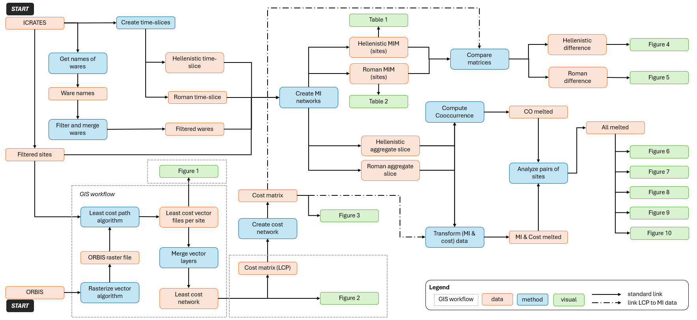

# ancient_routes_paper

The repository contains material supportive to publication:

Daems, D. and Kafetzaki, D. (Accepted). Unravelling the Threads of Connectivity: A Mutual Information Approach to Tracing Material Networks in the Late Hellenistic and Early Roman Mediterranean. _Journal of Archaeological Science._

## Original data sources

The original data sources are [ICRATES](https://archaeologydataservice.ac.uk/archives/view/icrates_lt_2018/) and [Orbis](https://orbis.stanford.edu/). The ICRATES data provide the basis to create the mutual information (MI) data. The Orbis data provide the basis to create the least cost path (CO) data. These are combined using the workflow visualised in the [workflow schema](#workflow_schema).

## Repository structure

### ./data/
The folder contains data files created based on the two public data sources and on the workflow presented schematically in [workflow schema](#workflow_schema). 

Download the ICRATES data from https://archaeologydataservice.ac.uk/archives/view/icrates_lt_2018/downloads.cfm in the `./data/ICRATES/` folder. 

### ./GIS/
The folder contains shapefiles to reconstruct the least-cost path networks. The folder also contains a workflow document `QGIS_workflow.pdf` that allows others to reproduce our analysis.

| data file name             | description                                                             |
| -------------------------- | ----------------------------------------------------------------------- |
| ICRATES_Sites.shp          | Sites filtered from Icrates dataset                                     |
| LCP_Network.shp            | LCP network                                                             |
| ORBIS.shp                  | ORBIS geospatial network data                                           |
| ORBIS_ShortestDistance.shp | Shortest distances between filtered sites using the ORBIS network model |

Download the Orbis data from https://github.com/emeeks/orbis_v2/blob/master/base_routes.geojson.

### ./visuals/
The folder contains all figures and tables of the publication.

### ./src/

The following table lists the R scripts in the sequence they are run. A short description and the Figures resulting from each script are also included in teh table.

| script                        | purpose                                                             | plot                   |
| ----------------------------- | ------------------------------------------------------------------- | ---------------------- |
| 1. *create_cost_network.R*    | Transform least cost value paths to matrix format                   | Figure 3               |
| 2. *create_time-slices.R*     | Create ICRATES time slices per fabric and location                  | -                      |
| 3. *select_wares.R*           | Filter and merge wares of interest: ESA, ESB, ESC, ESD, ITS         | -                      |
| 4. *create_MI_networks.R*     | Create mutual information matrices (MIM) per time slice and site    | Tables 1, 2            |
| 5. *compute_coocurrence.R*    | Calculate co-occurrence of wares for each pair of sites             | -                      |
| 6. *transform_MI&Cost_data.R* | Transform MI and Cost to dataset                                    | -                      |
| 7. *compare_matrices.R*       | Compare matrices of cost and mutual information                     | Figures 4, 5           |
| 8. *analyse_pairs-of-sites.R* | Visualize data based on cost, mutual information and co-accourrence | Figures 6, 7, 8, 9, 10 |

## Workflow

The workflow is schematically presented at `./ancient_routes_paper.png`. The R script `./ancient_routes_paper.R` combines all R components into the workflow.

### Requirements
The file `./requirementsR.txt` includes the R libraries used for the R workflow in R version 4.3.1.

The file `./requirementsGIS.txt` includes the GIS plugins used for the GIS workflow in QGIS version 3.34.3-Prizren.
